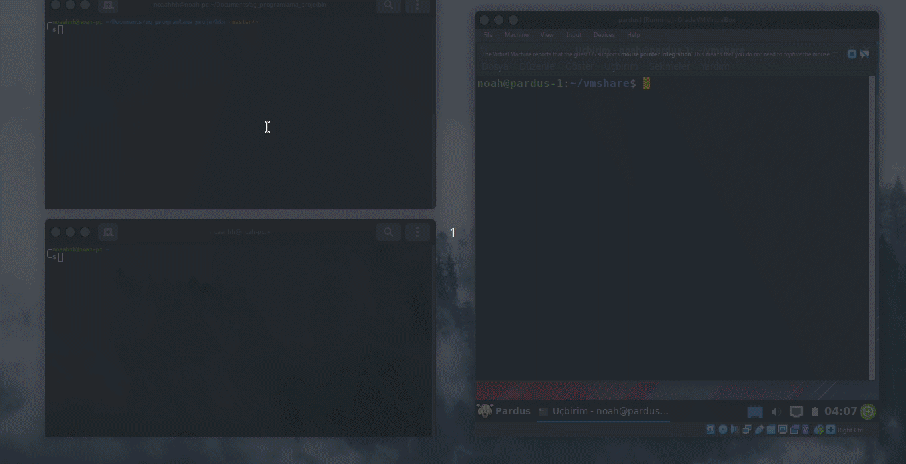

# ping-tool-with-libpcap 


 <div align="center">
  <h3>Server-Client ICMP ping app using libpcap library </h3>
  
  
  <br>
  <a href="https://github.com/noaahhh/ping-tool-with-libpcap/issues"></a>
  <a href="https://github.com/noaahhh/ping-tool-with-libpcap/issues/stargazers"></a>
  <a href="https://github.com/noaahhh/ping-tool-with-libpcap/issues/blob/main/LICENSE"></a>
</div>


<!-- ABOUT THE PROJECT -->
## About The Project
The project aims to be server-client ICMP ping aplication. It contains two binary and two code files. Client-side binary can send ICMP package and server-side application can capture and resend a response. It can think like a client-server ping application.

<p align="right">(<a href="#top">back to top</a>)</p>


### Built With
* [libpcap](https://www.tcpdump.org/)

<p align="right">(<a href="#top">back to top</a>)</p>


<!-- GETTING STARTED -->
## Getting Started

This is an example of how you may give instructions on setting up your project locally.
To get a local copy up and running follow these simple example steps.

### Prerequisites

* libpcap

for Debian based
```sh
$ sudo apt install libpcap-dev
```
for RHEL based
```sh
$ sudo yum install libpcap-dev
```
adding pcap header with
```c
#include <pcap.h>
```

### Installation

``` sh
$ sudo  gcc src/ping_client.c  -o bin/ping_client 
$ sudo gcc src/ping_server.c -o bin/ping_server
```

<p align="right">(<a href="#top">back to top</a>)</p>


<!-- USAGE EXAMPLES -->
## Usage
to start server-side app

```sh
sudo ./ping_server 
```
to send a ICMP package to server
```sh
sudo ./ping_client <ip_address> -c 4 #  4 ping message
```
<!-- LICENSE -->
## License

There is no License for the project. 

<p align="right">(<a href="#top">back to top</a>)</p>


<!-- CONTACT -->
## Contact

@noaahhh - [@noah_the_turk](https://twitter.com/noah_the_turk) 

Project Link: [https://github.com/noaahhh/ping-tool-with-libpcap](https://github.com/noaahhh/ping-tool-with-libpcap)

<p align="right">(<a href="#top">back to top</a>)</p>


<!-- ACKNOWLEDGMENTS -->
## Acknowledgments
---
<p align="right">(<a href="#top">back to top</a>)</p>

